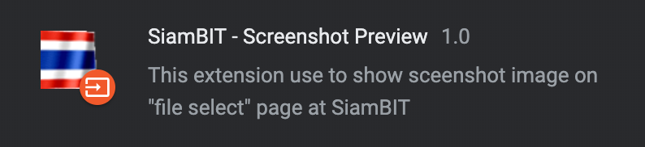
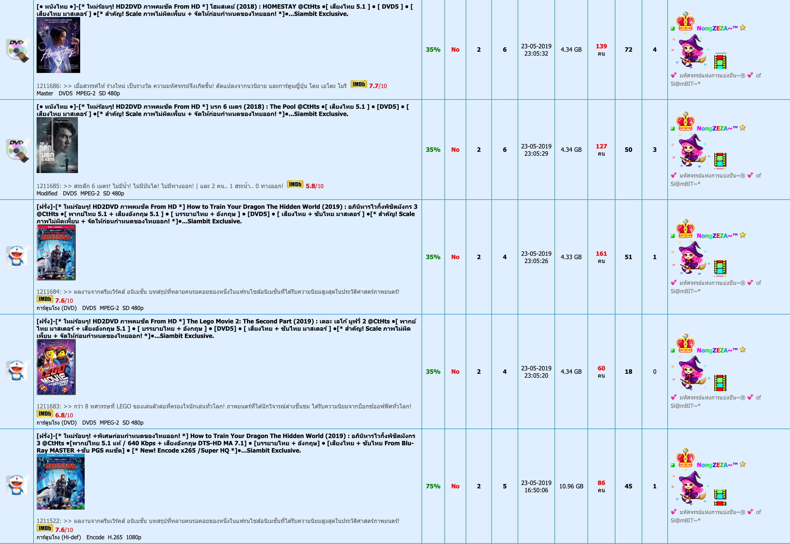
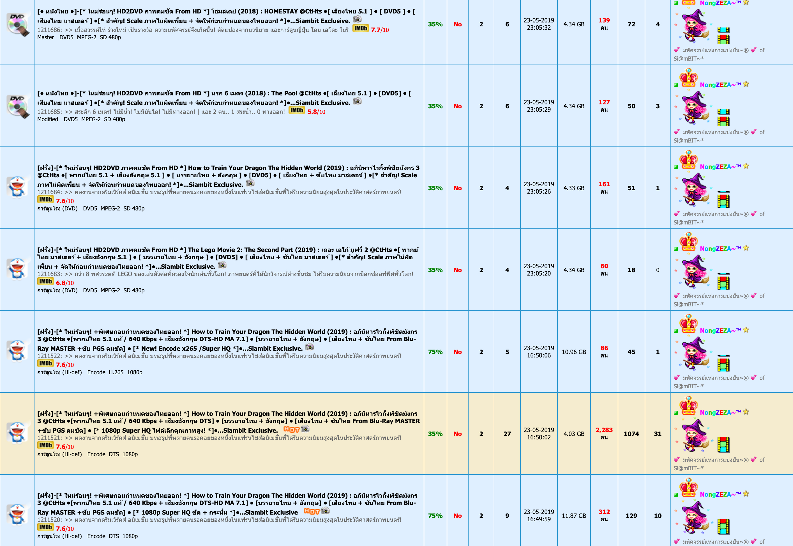

# SiamBIT - Screenshot Preview
Chrome extension show sceenshot image on "file select" page at SiamBIT
_____
# Preview

|||
|:-----:|:-----:|
|Extension ✅|Extension ❌|

# How to install ?
1. Download [SiamBIT - Screenshot Preview.crx](https://github.com/max180643/SiamBIT-Screenshot-Preview/raw/master/SiamBIT%20-%20Screenshot%20Preview.crx)
> Google Chrome maybe alert this type of file can harm your computer.  
If you don't sure this file is safe, [Check this](https://www.virustotal.com/#/file/30c88cb97e2651618d2bd3b945da7d67527e4b8fe399ed665bd7da5f275ac46b/detection) (Virustotal).
2. Go to "chrome://extensions"
3. Drag Download file to this page
4. Click "Add extension"
5. Enjoy !